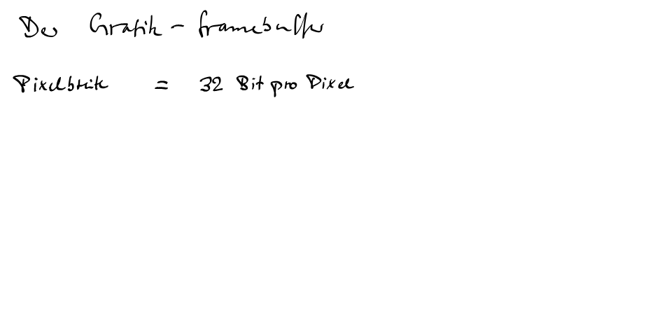

# linux-framebuffer-development
 hardwareunabhängige API, die direkten Zugriff auf den Videospeicher (Framebuffer) eines Computers ermöglicht. Es ist ein Kernelmodul, das als Gerätedatei (/dev/fb0, /dev/fb1 usw.) zugänglich ist.

Einsatz in der Spieleentwicklung, für eingebettete Systeme oder wenn man die X Window System (KDE, GNOME usw. basieren darauf) vermeiden möchte.
Hier sind die Hauptansätze und Bibliotheken, die du dafür nutzen kannst:
Framebuffer-Programmierung (Linux Framebuffer Device, fbdev):

Was es ist: Das Linux-Framebuffer ist eine hardwareunabhängige API, die direkten Zugriff auf den Videospeicher (Framebuffer) eines Computers ermöglicht. Es ist ein Kernelmodul, das als Gerätedatei (/dev/fb0, /dev/fb1 usw.) zugänglich ist.

Wie es funktioniert: Du kannst direkt Pixeldaten in diese Gerätedatei schreiben, um Grafiken auf dem Bildschirm darzustellen. Dies ermöglicht dir, den gesamten Bildschirm zu kontrollieren, ohne einen Display-Server wie X zu starten.
Für deine Anforderungen:

Hintergrund aus Bitmap-Tiles: Du liest deine Tile-Bitmaps ein und schreibst sie in den entsprechenden Speicherbereich des Framebuffers, um den Hintergrund zu zeichnen.

Scrollbarer Hintergrund: Du kannst den Bereich, der angezeigt wird, einfach verschieben, indem du die Startadresse im Framebuffer neu berechnest oder den Inhalt des Speichers verschiebst, bevor er an den Bildschirm gesendet wird.

Sprites: Sprites sind im Grunde kleine Bitmaps, die du über den Hintergrund zeichnest. Du musst die Transparenz (Alpha-Werte) der Sprites berücksichtigen und sie korrekt auf den Hintergrund rendern.

Vorteile: Sehr niedrige Ebene, volle Kontrolle, keine Abhängigkeiten von X11. Ideal für Embedded-Systeme oder Performance-kritische Anwendungen.
Nachteile: Sehr aufwändig, da du alles selbst implementieren musst (Pixel-Operationen, Scrolling-Logik, Sprite-Management, Event-Handling für Tastatur/Maus). Es ist nicht hardwarebeschleunigt, es sei denn, der Treiber bietet entsprechende Funktionen.
Bibliotheken, die auf dem Framebuffer aufsetzen (oder es als Backend nutzen können):

Der Schlüssel liegt darin, das X Window System (und damit Desktops wie KDE) zu umgehen und direkt mit der Grafikhardware auf einer niedrigeren Ebene zu interagieren.
Für die größte Kontrolle und um die Funktionsweise wirklich zu verstehen: Direkte Framebuffer-Programmierung (C/C++).
Für eine gute Balance aus Kontrolle, Funktionalität und Entwicklungsfreundlichkeit: SDL oder Allegro (mit fbdev-Backend). Diese sind wahrscheinlich die beste Wahl für die meisten Projekte, die deine Anforderungen erfüllen.
Eine spezialisierte Option, die ebenfalls gut passt, ist DirectFB, falls du die Bibliothek magst und die Entwicklung für deine Zwecke ausreichend ist.

Ziele:

Uridium Clone
Intro/Demo  Programmierung

mehr im wiki
https://github.com/peterausneuss/linux-framebuffer-development/wiki

